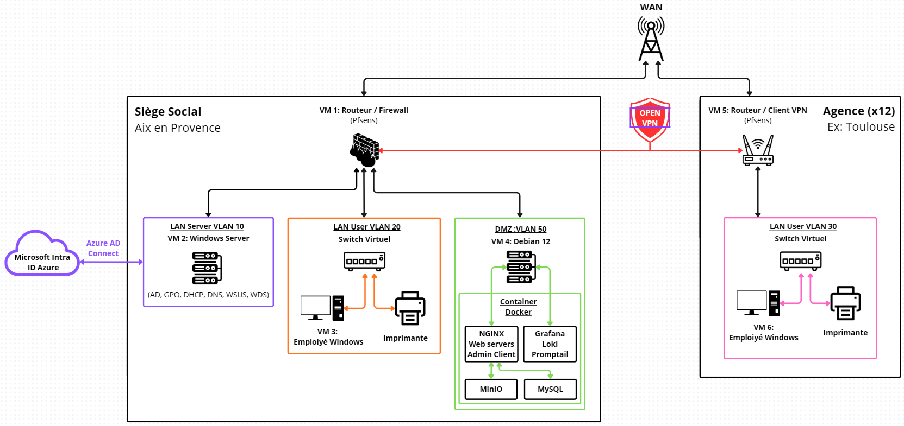

# Architecture & Adressage

> Ce document présente le schéma d'architecture du projet, ainsi que les adresses IP utilisées pour chaque composant de l'infrastructure.

---

## Architecture

---

## Allocation des ressources (environnement de maquette)

Afin de garantir le bon fonctionnement de l'infrastructure globale sur une machine hôte limitée à 16 Go de RAM et 500 Go de stockage, les ressources de chaque machine virtuelle ont été strictement optimisées.

> **Note importante :** tous les disques durs virtuels sont configurés en **allocation dynamique** (thin provisioning) afin de ne consommer de l'espace physique sur le PC hôte que lorsque c'est réellement nécessaire.

| Nom de la VM | OS cible | RAM | vCPU (Proc / Cœurs) | Cartes réseau (VMnet) | Stockage (taille & type) |
|:---|:---|:---|:---|:---|:---|
| **VM 1 : Routeur Siège** | FreeBSD (pfSense 2.8) | `512 Mo` | 1 Proc / 1 Cœur | **Carte 1 :** NAT (WAN) **Carte 2 :** VMnet1 (LAN) | `8 Go` (SCSI - LSI Logic) *Single file* |
| **VM 2 : Windows Server** | Windows Server 2022 | `3 Go` | 1 Proc / 2 Cœurs | **Carte 1 :** VMnet1 | `40 Go + 80 Go WDS` (NVMe ou SCSI SAS) *Single file* |
| **VM 3 : Client Siège** | Windows 11 | `4 Go` | 1 Proc / 2 Cœurs | **Carte 1 :** VMnet1 | `30 Go` (NVMe) *Single file* |
| **VM 4 : Debian Docker** | Debian 12 64-bit | `2 Go` | 1 Proc / 2 Cœurs | **Carte 1 :** VMnet1 | `20 Go` (SCSI - LSI Logic) *Single file* |
| **VM 5 : pfSense Agence** | FreeBSD (pfSense 2.8) | `512 Mo` | 1 Proc / 1 Cœur | **Carte 1 :** NAT (WAN) **Carte 2 :** VMnet2 (LAN) | `8 Go` (SCSI - LSI Logic) *Single file* |
| **VM 6 : Client Agence** | Windows 11 | `2 Go` | 1 Proc / 2 Cœurs | **Carte 1 :** VMnet2 | `30 Go` (NVMe) *Single file* |

**Total RAM maximale allouée : 10 Go / 16 Go** (laissant 6 Go pour le système hôte).

> **Remarque :** les adresses MAC ne sont pas figées dans cette maquette : elles sont attribuées automatiquement par l'hyperviseur (VMware Workstation Pro) et relevées lors de la création des réservations DHCP (voir [Guide de déploiement](Guide_Deploiement.md)).

---

## Adressage

| Zone / Réseau | Équipement / Rôle | Adresse IP / Plage | Passerelle (pfSense) |
|:---|:---|:---|:---|
| **VLAN 10 - Serveurs (Siège)** | Windows Server 2022 (AD, DNS, DHCP, WDS, WSUS) | `10.0.10.10` | `10.0.10.254` |
| **VLAN 20 - LAN (Siège)** | Clients Windows 11 & imprimantes | DHCP `10.0.20.100` à `200` | `10.0.20.254` |
| **VLAN 50 - DMZ (Siège)** | Debian 12 (hôte Docker) | `10.0.50.10` | `10.0.50.254` |
| **VLAN 30 - LAN (Agence Toulouse)** | Clients Windows 11 & imprimantes | DHCP `10.1.30.100` à `200` | `10.1.30.254` |
| **Interconnexion VPN** | Serveur pfSense (Siège) | `172.16.0.1` | *N/A* |
| **Interconnexion VPN** | Client pfSense (Agence) | `172.16.0.2` | *N/A* |

> **Note de cohérence :** l'interface LAN du pfSense Agence correspond à la passerelle du VLAN 30, soit `10.1.30.254`. C'est cette adresse qu'il faut utiliser pour accéder à l'interface web d'administration du routeur agence (cf. [Guide de déploiement](07-guide-deploiement.md)).

---

### VLAN 10 - Serveurs (Siège)

Ce VLAN est dédié au serveur Windows Server 2022, qui héberge :

- **Active Directory (AD)** : contrôleur de domaine local (`alc.local`), avec application de règles GPO.
- **Synchronisation hybride Azure AD (Entra ID)** : via Azure AD Connect / Cloud Sync, pour permettre une gestion centralisée des identités, un SSO sur les services Microsoft (Teams, Outlook, etc.) et un accès facilité pour les utilisateurs distants. L'annuaire de référence reste l'AD on-premise ; Entra ID en est une synchronisation.
- **DNS** : résolution de noms interne.
- **DHCP** : attribution des adresses IP aux clients des VLANs.
- **Serveur de fichier** : héberge les fichier partager des différents pôle de l'entreprise.

> Cette machine centralise la gestion des employés, que ce soit pour le siège ou pour les agences.

### VLAN 20 - LAN (Siège)

Ce VLAN est dédié aux postes clients du siège (Windows 11) et aux imprimantes :

- Les clients reçoivent leur adresse IP via DHCP depuis le Windows Server 2022.
- Les clients sont gérés via des GPO depuis le Windows Server 2022 pour assurer la sécurité et la conformité des postes de travail.
- Les imprimantes sont connectées à ce VLAN pour permettre l'impression depuis les postes de travail, et reçoivent leur adresse via DHCP.

> Une seule machine Windows 11 cliente est représentée pour le siège, mais en réalité elle peut être dupliquée pour représenter tous les employés.

### VLAN 50 - DMZ (Siège)

Ce VLAN est dédié à la machine Debian 12 qui héberge les conteneurs Docker :

- **Conteneur 1** : serveur web (Nginx) hébergeant le site de l'entreprise (back-office admin et front client).
- **Conteneur 2** : MinIO, pour le stockage des images du site (admin et client).
- **Conteneur 3** : base de données (MySQL) du site.
- **Conteneur 4 (stack supervision)** :
  - **Grafana** : interface de visualisation.
  - **Promtail** : collecte et labellisation des logs, envoyés à Loki.
  - **Loki** : stockage et indexation des logs pour une recherche rapide.
  - **Prometheus** + **Node Exporter / Windows Exporter** : collecte des métriques systèmes et réseau.

> Cette machine est accessible depuis le réseau local du siège, mais aussi depuis le réseau de l'agence via le VPN.

### VLAN 30 - LAN (Agence Toulouse)

Ce VLAN est dédié aux postes clients de l'agence de Toulouse (Windows 11) et aux imprimantes :

- Les clients reçoivent leur adresse IP via DHCP depuis le Windows Server 2022 du siège.
- Les clients sont gérés via des GPO depuis le Windows Server 2022 du siège.
- Les imprimantes sont connectées à ce VLAN pour permettre l'impression locale.
- Les clients de l'agence accèdent aux ressources du siège (serveur web, base de données, stockage) via le VPN.

> Une seule machine Windows 11 cliente est représentée pour l'agence, mais en réalité elle peut être dupliquée pour représenter tous les employés de l'agence. Le modèle est conçu pour être répliqué facilement pour de nouvelles agences (nouveau VLAN + nouveau tunnel VPN).

### Interconnexion VPN

Le VPN connecte de manière sécurisée les réseaux du siège et de l'agence :

- Le pfSense du siège est configuré en serveur OpenVPN, acceptant les connexions entrantes (port `1194`).
- Le pfSense de l'agence est configuré en client OpenVPN, établissant une connexion sortante vers le siège.
- Une fois la connexion établie, les clients de l'agence accèdent aux ressources du siège comme s'ils étaient sur le même réseau local, avec un chiffrement de bout en bout.

> Le VPN permet de centraliser la gestion des ressources et des services au siège, tout en offrant une flexibilité pour les agences et les utilisateurs distants.

---

## Choix techniques notables

- **IPv6 désactivé** : dans cet environnement virtualisé (VMware), IPv6 n'est pas déployé afin d'éviter les problématiques liées à la double pile (surface d'attaque étendue, filtrage incomplet, incohérences de routage). L'ensemble des flux est maîtrisé en IPv4 via le VPN ; IPv6 n'apporterait pas de valeur fonctionnelle à ce stade.
- **Stockage en allocation dynamique** sur toutes les VM pour optimiser l'usage du disque hôte.
- **Pas de RAID** : la virtualisation permet de s'en passer (configuration disque en stripe).
