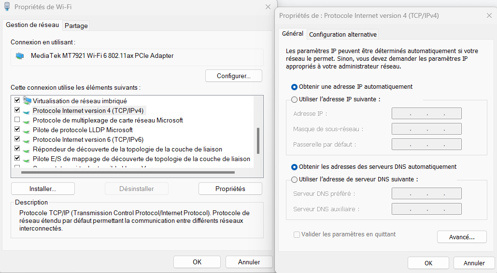
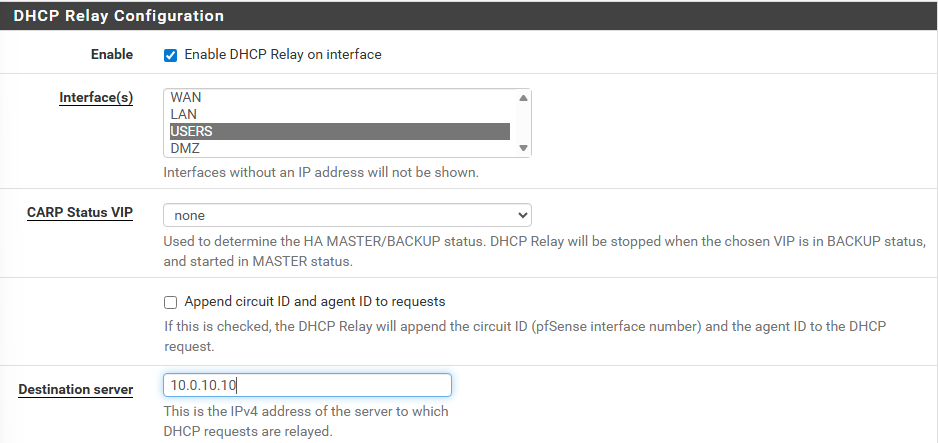
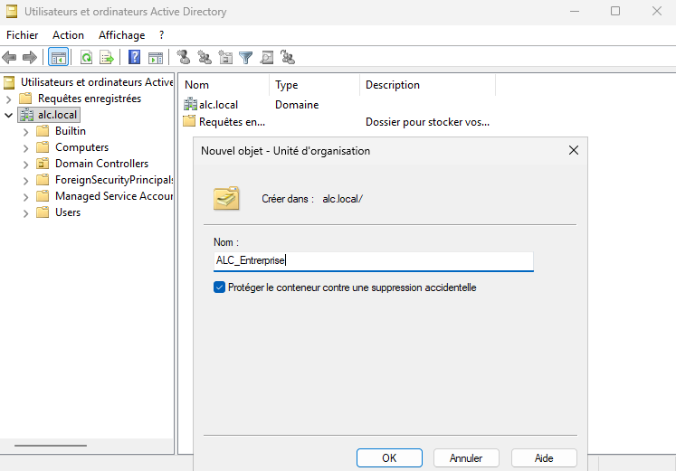
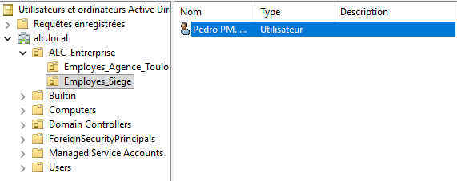
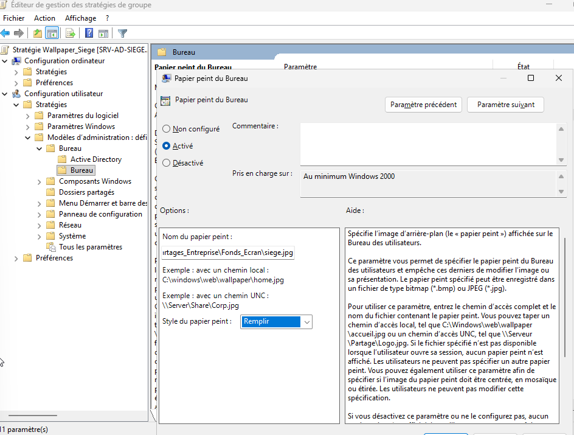

# Guide de configuration des serveurs

> Ce document détaille la configuration des rôles et services installés sur le serveur Windows Server 2022 (`SRV-AD-SIEGE`) et sur la machine Debian 12 (DMZ), une fois les VM provisionnées (cf. [Guide de déploiement](Guide_Deploiement.md) pour l'installation initiale des VM).

---

## 1. Windows Server 2022 — Fondations système

### 1.1 Renommage et préparation

- Renommer la machine en `SRV-AD-SIEGE`.
- Configurer l'adresse IP statique (`10.0.10.10`), la passerelle (`10.0.10.254`) et le DNS selon le [plan d'adressage](Architecture_Adressage.md).



### 1.2 Active Directory Domain Services (AD DS)

- Ajout du rôle **AD DS** depuis le Gestionnaire de serveur.
- Promotion en contrôleur de domaine : création d'une nouvelle forêt, nom de domaine `alc.local`.
- La délégation DNS peut être ignorée lors de l'installation (environnement isolé).

### 1.3 Service DHCP

- Ajout du rôle **Serveur DHCP**.
- Autorisation du serveur DHCP dans Active Directory (étape finale de l'assistant).
- Création d'une étendue (pool d'adresses) par VLAN, selon le [plan d'adressage](Architecture_Adressage.md) :
  - VLAN 20 (LAN Siège) : `10.0.20.100` – `10.0.20.200`
  - VLAN 30 (LAN Agence, via relais DHCP) : `10.1.30.100` – `10.1.30.200`
- Aucune exclusion définie dans les étendues.
- Durée de bail : 8 jours (valeur par défaut).
- Configuration de l'option **passerelle (003)** pour chaque étendue, afin que les clients récupèrent la bonne route par défaut.

### 1.4 Relais DHCP (pfSense)

Le pfSense de chaque site relaie les requêtes DHCP vers le serveur Windows Server 2022 du siège (`10.0.10.10`).



---

## 2. Active Directory — Organisation et stratégies

### 2.1 Unités d'organisation

Une unité d'organisation racine `ALC_Entreprise` regroupe deux sous-unités correspondant aux sites :

- `Employes_Siege`
- `Employes_Agence_Toulouse`



Chaque OU de site contient les 5 pôles métier (cf. [Sécurité & Droits d'accès](02-securite-droits.md)).

### 2.2 Utilisateurs de test

Un utilisateur de test est créé dans chaque unité d'organisation pour valider la jonction au domaine et l'application des GPO.



### 2.3 Stratégies de groupe (GPO)

Trois GPO principales sont déployées :

1. **Mappage de lecteur réseau** : connecte automatiquement le partage `\\10.0.10.10\DATA$` (cf. [Sécurité & Droits d'accès](Securite_et_droit.md)).

   - Chemin : `Configuration utilisateur > Préférences > Paramètres Windows > Mappages de lecteurs`

   

2. **Verrouillage automatique de session** après 300 secondes (5 min) d'inactivité.

   - Chemin : `Configuration ordinateur > Stratégies > Paramètres Windows > Paramètres de sécurité > Stratégies locales > Options de sécurité > Ouverture de session interactive : limite d'inactivité de l'ordinateur`

3. **Restriction des outils d'administration** (Panneau de configuration et invite de commandes/PowerShell) pour les utilisateurs standards.

   - Chemin (Panneau de config) : `Configuration utilisateur > Stratégies > Modèles d'administration > Panneau de configuration > Interdire l'accès au Panneau de configuration et aux paramètres PC`
   - Chemin (CMD) : `Configuration utilisateur > Stratégies > Modèles d'administration > Système > Désactiver l'accès à l'invite de commandes`

4. **Fond d'écran imposé par site** : un fond d'écran différent par site (siège / agence), via un dossier partagé en lecture sur tout le réseau (`\\SRV-AD-SIEGE\Partages_Entreprise\Fonds_Ecran\`).

   - Chemin : `Configuration utilisateur > Stratégies > Modèles d'administration > Bureau > Bureau > Papier peint du Bureau`

   

   > Cette GPO permet d'identifier visuellement, en un coup d'œil, de quel site provient un poste connecté.

---

## 3. Windows Deployment Services (WDS)

WDS permet de proposer automatiquement une image système (ISO) à une machine cliente dès son démarrage réseau (PXE), évitant toute intervention manuelle.

### 3.1 Préparation du disque

- Ajout d'un second disque virtuel **NVMe de 80 Go** à la VM Windows Server (à l'arrêt).
- Au redémarrage, initialisation du disque en **GPT**, création d'un volume simple formaté en **NTFS**, lettre `D:` ou `E:`.

### 3.2 Installation et configuration du rôle

- Ajout du rôle **Services de déploiement Windows** (avec ses fonctionnalités requises).
- Configuration du serveur : intégration à Active Directory, choix du dossier `E:\RemoteInstall` comme racine de stockage des images.
- Activation des deux cases liées au DHCP (le serveur fait à la fois DHCP et WDS).
- Paramètres PXE : réponse à **tous les clients** (connus et inconnus), avec **approbation administrateur obligatoire** pour les clients inconnus (sécurité supplémentaire).

### 3.3 Ajout des images

- Récupération de `boot.wim` et `install.wim` depuis l'ISO Windows 11 (dossier `sources`).
- Création d'un groupe d'images et ajout de `install.wim` (édition Pro standard).
- Démarrage du serveur WDS.

### 3.4 Test

- Création d'une nouvelle VM **sans ISO**.
- Récupération de son adresse MAC depuis l'hyperviseur.
- Création d'une **réservation DHCP** correspondante dans l'étendue concernée, pour préparer le client PXE.

---

## 4. Service de fichiers et droits d'accès

Voir [Sécurité & Droits d'accès](Securite_et_droit.md) pour le détail complet de la structure des dossiers, groupes de sécurité et permissions NTFS.

Configuration côté serveur :

1. Ajout d'un disque virtuel dédié, monté sur le serveur.
2. Création du dossier `DATA`, partagé sous le nom `DATA$` (partage masqué).
3. Autorisations de partage : contrôle total pour tout le monde (restrictions réelles gérées au niveau NTFS).
4. Création de 5 sous-dossiers (un par pôle), avec héritage NTFS désactivé et droits explicites par groupe de sécurité.

Côté client, connexion au lecteur réseau (`\\10.0.10.10\DATA$`) — automatisée par GPO en production, mais réalisable manuellement pour test :

1. Explorateur de fichiers > clic droit sur **Ce PC** > **Connecter un lecteur réseau**.
2. Choisir une lettre (ex. `S:`).
3. Saisir le chemin `\\10.0.10.10\DATA$`.
4. Cocher **Se connecter lors de la connexion**.

---

## 5. Microsoft Entra ID — Synchronisation hybride

L'objectif est de centraliser l'authentification SSO (Single Sign-On) sur les services Microsoft (Teams, Outlook…) en synchronisant l'AD local vers le cloud, sans migrer l'annuaire de référence.

### 5.1 Préparation du domaine

- Création d'un suffixe UPN additionnel sur le domaine `alc.local`, correspondant au domaine fourni gratuitement par Microsoft : `alclaboutlook.onmicrosoft.com`.
  - Outil : **Domaines et approbations Active Directory** > Propriétés > Autres suffixes UPN.
- Pour chaque utilisateur à synchroniser, mise à jour du suffixe UPN (onglet Compte) en sélectionnant le nouveau domaine dans la liste déroulante.

### 5.2 Compte de synchronisation

- Création, dans Microsoft Entra ID, d'un utilisateur dédié `admin-sync` avec le rôle **Administrateur Général**, exclusivement destiné à la synchronisation AD ↔ Entra ID.

### 5.3 Installation de l'agent de synchronisation

- Sur le portail Azure : **Entra Connect > Cloud Sync** > section supervision > sélection de l'agent de synchronisation.
- Téléchargement et installation de l'agent (`.exe`) sur le Windows Server 2022.
- Connexion avec le compte `admin-sync@alclaboutlook.onmicrosoft.com`.
- Création d'un **gMSA** (Group Managed Service Account) à l'aide des identifiants du Windows Server.

### 5.4 Configuration de la synchronisation

- Retour sur le portail Azure (Cloud Sync) : création d'une nouvelle configuration de synchronisation — l'agent détecte et répertorie automatiquement le domaine `alc.local`.
- Provisionnement à la demande : test de présence d'un utilisateur via son **Distinguished Name (DN)**.
  - Récupération du DN : `Utilisateurs et ordinateurs AD > Affichage > Fonctionnalités avancées` > propriétés de l'utilisateur > onglet **Éditeur d'attributs** > champ `distinguishedName`.
- Validation et activation depuis la **Vue d'ensemble** de la configuration de synchronisation.

### 5.5 Vérification

- Dans **Microsoft Entra ID > Utilisateurs**, l'utilisateur synchronisé doit apparaître. L'infrastructure est alors **hybride**.

---

## 6. Debian 12 — Fondations système (DMZ)

### 6.1 Configuration réseau

Configuration de l'interface VLAN 50 dans `/etc/network/interfaces` :

```
auto ens33.50
iface ens33.50 inet static
    address 10.0.50.10/24
    gateway 10.0.50.254
    dns-nameservers 1.1.1.1 1.0.0.1
    vlan-raw-device ens33
```

Redémarrage du service réseau :

```bash
systemctl restart networking
```

> **Dépannage (installation Netinst)** : si la résolution de noms échoue, vérifier/créer `/etc/resolv.conf` :
> ```
> nameserver 1.1.1.1
> nameserver 1.0.0.1
> ```
> Si `apt` échoue car il pointe sur le CD-ROM local, éditer `/etc/apt/sources.list`, commenter la ligne pointant sur le disque local et ajouter :
> ```
> deb http://deb.debian.org/debian/ bookworm main non-free-firmware
> deb http://security.debian.org/debian-security bookworm-security main non-free-firmware
> deb http://deb.debian.org/debian/ bookworm-updates main non-free-firmware
> ```

### 6.2 Mise à jour et installation de Docker

```bash
apt update && apt upgrade -y
apt install docker.io docker-compose -y
systemctl enable --now docker
docker --version && docker-compose --version
```

### 6.3 Serveur SSH

```bash
apt install openssh-server -y
systemctl status ssh
systemctl enable ssh
```

> **Accès distant** : par défaut, le réseau ne permet pas la connexion depuis une machine physique externe. Une règle NAT dédiée sur le pfSense agence (interface WAN) redirige vers le port 22 de la DMZ.
>
> Connexion : `ssh dmz@<IP_WAN_du_routeur_siège>`


---

## 7. Déploiement de l'application web (DMZ)

```bash
apt-get install git -y
cd /opt/
git clone <url_du_repo>
```

- Édition des fichiers `.env` et du `docker-compose.yml` : remplacement des adresses `localhost` par l'adresse de la DMZ (`10.0.50.10`).
- Remplacement des certificats de test (mkcert) par des certificats OpenSSL :

```bash
openssl req -x509 -nodes -days 365 -newkey rsa:2048 \
  -keyout docker/nginx/certs/localhost-key.pem \
  -out docker/nginx/certs/localhost.pem \
  -subj "/CN=10.0.50.10"
```

- Lancement des conteneurs :

```bash
docker-compose up -d
```

L'application est alors accessible sur l'ensemble de l'infrastructure à l'adresse de la DMZ, et exposée sur le WAN via le port forwarding configuré sur le pfSense siège (cf. [Sécurité & Droits d'accès](Securite_et_droit.md)).

---

## Voir aussi

- [Architecture & Adressage](Architecture_Adressage.md)
- [Sécurité & Droits d'accès](Securite_et_droit.md)
- [Plan de sauvegarde et supervision](Sauvegarde_Supervision.md)
- [Guide de déploiement](Guide_Deploiement.md)