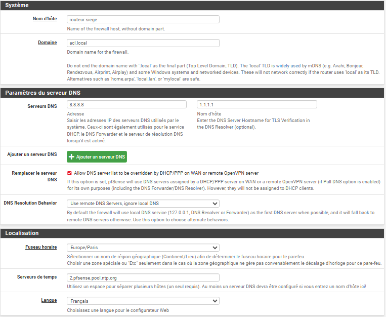
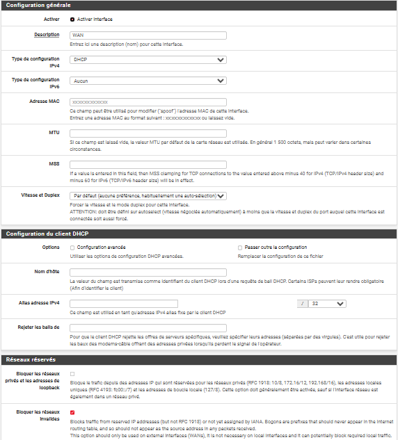
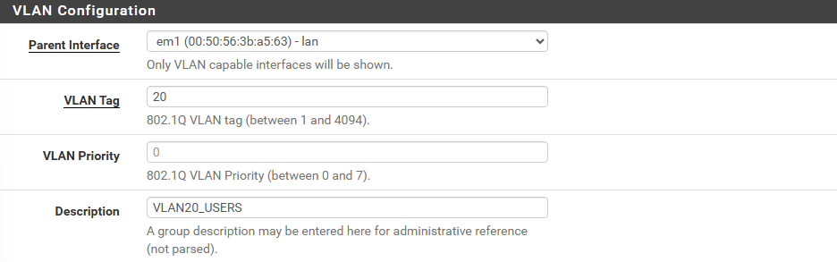
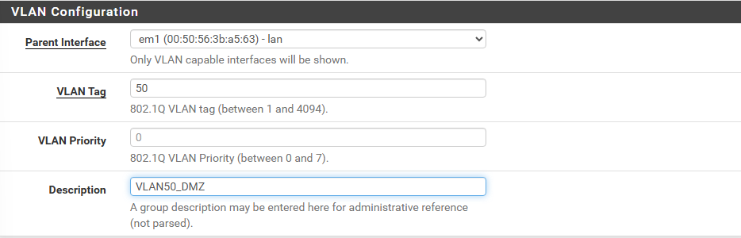
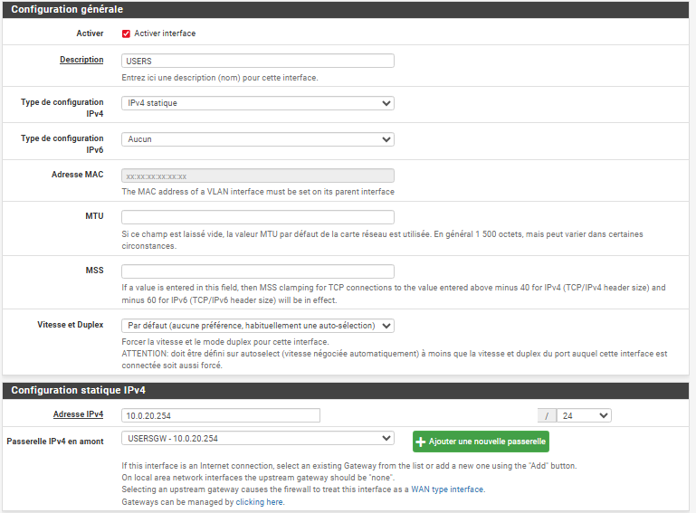
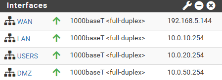
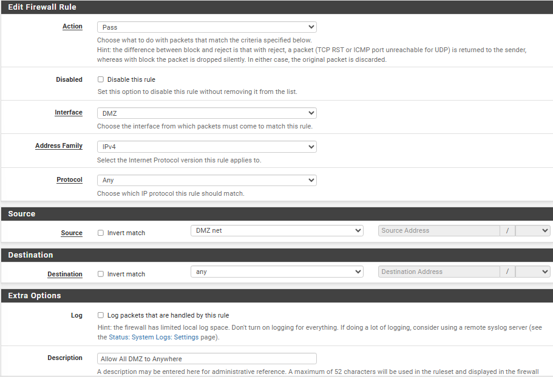
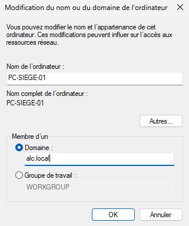
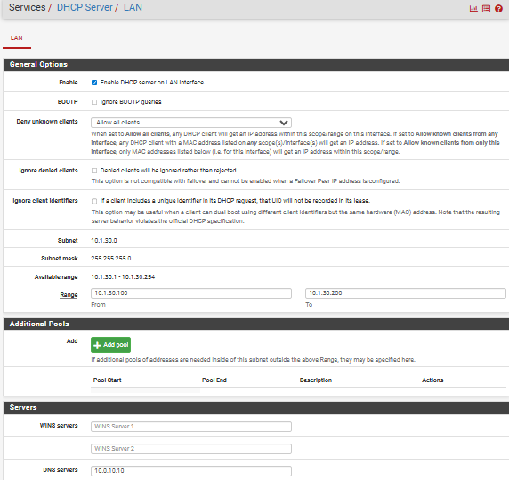
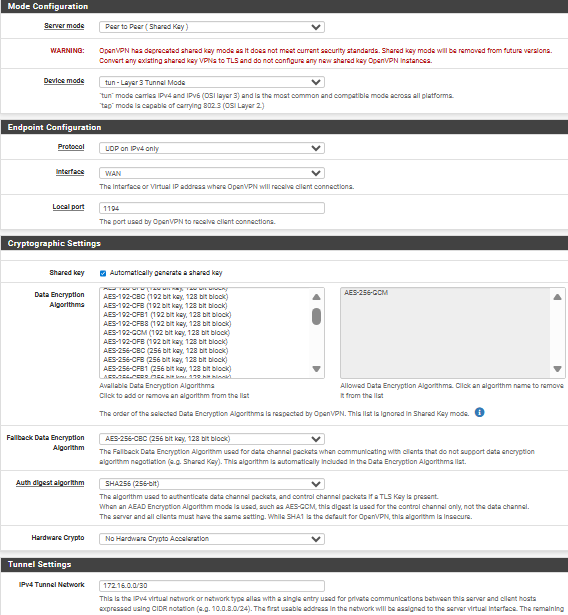

# Guide de déploiement

> Ce document reprend, étape par étape, la mise en place de l'infrastructure de la fondation virtuelle jusqu'aux services applicatifs et à la supervision. Pour la configuration détaillée des rôles serveurs (AD, DHCP, WDS, Entra ID...), se référer au [Guide de configuration des serveurs](Guide_Configuration_Serveurs.md).

---

## Sommaire

1. [Fondation VMware Workstation Pro](#1-fondation-vmware-workstation-pro)
2. [Routeur pfSense — Siège (Aix-en-Provence)](#2-routeur-pfsense--siège-aix-en-provence)
3. [Windows Server 2022 — Installation et réseau](#3-windows-server-2022--installation-et-réseau)
4. [Client Siège Windows 11](#4-client-siège-windows-11)
5. [Routeur pfSense — Agence Toulouse](#5-routeur-pfsense--agence-toulouse)
6. [Client Agence Windows 11](#6-client-agence-windows-11)
7. [VPN — Interconnexion Siège ↔ Agence](#7-vpn--interconnexion-siège--agence)
8. [Active Directory — Agence et GPO](#8-active-directory--agence-et-gpo)
9. [Debian 12 — DMZ et services Docker](#9-debian-12--dmz-et-services-docker)
10. [Annexes — Notes de débogage](#10-annexes--notes-de-débogage)

> Les sections **Active Directory détaillée**, **WDS**, **droits d'accès** et **supervision (Loki/Prometheus/Grafana)** sont traitées dans le [Guide de configuration des serveurs](Guide_Configuration_Serveurs.md) et le [Plan de sauvegarde et supervision](Sauvegarde_Supervision.md) pour éviter les redondances — ce présent guide y renvoie au bon moment.

---

## 1. Fondation VMware Workstation Pro

> Ce n'est en aucun cas obligatoire de passer par ce virtualiseur, mais cette documentation détaille les étapes clés liées à ce logiciel.

### 1.1 Configuration des réseaux virtuels

Depuis l'**Éditeur de réseau virtuel** :

- **VMnet8** : configuré en mode **NAT**, avec distribution DHCP activée — permet aux VM d'accéder au WAN.
- **VMnet1** (exemple pour le siège, Aix-en-Provence) : configuré en mode **Host-Only**, pour permettre la communication entre VM sans accès WAN. Le service DHCP est **désactivé** sur ce vSwitch (le Windows Server s'en charge). La connexion d'un adaptateur hôte est également désactivée, pour empêcher le PC hôte de communiquer avec les VM.
- **VMnet2** (exemple pour l'agence Toulouse) : même principe que VMnet1, connecté aux machines dédiées de l'agence.

> Ce modèle (un VMnet Host-Only par site) est conçu pour être répliqué en cascade pour chaque nouvelle agence créée.

### 1.2 Création des VM

Créer les **6 VM** nécessaires, avec les ressources adaptées (voir [Architecture & Adressage](Architecture_Adressage.md) pour le détail des ressources allouées).

> Pour un déploiement progressif, aucun ISO n'est monté à cette étape — chaque ISO est ajouté au moment de la configuration de la machine concernée.

**ISO utilisés :**

| Composant | Source | Version |
|:---|:---|:---|
| pfSense | https://www.pfsense.org/download/ | 2.8 (stable) |
| Debian 12 | https://www.debian.org/download | 12 (Bookworm) |
| Windows 11 | https://www.microsoft.com/fr-fr/software-download/windows11 | 25H2 |
| Windows Server | https://www.microsoft.com/fr-fr/evalcenter/download-windows-server-2022 | **2022** |

> ⚠️ **Correction** : le lien de téléchargement original pointait vers Windows Server **2025**. Conformément au [plan d'adressage](Architecture_Adressage.md) et à l'ensemble de la documentation, la version réellement utilisée est **Windows Server 2022**. Veiller à télécharger l'ISO correspondant.

---

## 2. Routeur pfSense — Siège (Aix-en-Provence)

### 2.1 Installation

- Installer l'ISO **pfSense 2.8 (stable)**.
- Système de fichiers : **ZFS (Auto)** — recommandé par défaut.
- Type de configuration disque (vdev) : **Stripe** (la virtualisation permet de se passer de RAID).
- Sélectionner le disque virtuel présenté (généralement `da0` ou `vtbd0`).
- Confirmer la destruction des données et redémarrer.

### 2.2 Configuration IP initiale

- Depuis la console (touche 2), configurer l'adresse IP selon le [plan d'adressage](Architecture_Adressage.md), et **désactiver le DHCP** (le DHCP sera géré par Windows Server).

> **IPv6** : dans cet environnement virtualisé sous VMware, IPv6 n'est pas déployé, afin d'éviter les problématiques liées à la double pile (surface d'attaque étendue, filtrage incomplet, incohérences de routage). L'ensemble des flux étant maîtrisé en IPv4 via le VPN, l'activation d'IPv6 n'apporterait pas de valeur fonctionnelle à ce stade.

**Test** : depuis le navigateur du PC hôte, accéder à l'adresse IP du routeur — si l'interface apparaît, il y a une erreur de configuration réseau (seules les machines de l'infrastructure doivent y avoir accès).

### 2.3 Configuration via interface web

- Accès : `http://10.0.10.254` (passerelle siège — cf. [plan d'adressage](Architecture_Adressage.md))
- Identifiants par défaut : `admin` / `pfsense`

> **⚠️ Désactiver ABSOLUMENT le blocage RFC1918 sur le WAN.** Par défaut, un pare-feu bloque les adresses IP privées arrivant sur son interface publique (WAN). Or ici, l'environnement tournant sur VMware derrière une box Internet, l'adresse WAN utilisée est elle-même une adresse privée. Si cette option reste activée, pfSense bloquera l'accès à Internet.

**Configuration générale** (`Système > Configuration générale`) :



**Configuration WAN** (`Interfaces > WAN`) :



**Test** : depuis le navigateur, rechercher `google.com` — si la page s'affiche, l'accès WAN fonctionne.

- Vérifier les mises à jour disponibles et redémarrer le routeur.

### 2.4 Création des VLANs

Depuis `Interfaces > Assignation d'interfaces > VLANs`, créer les VLANs nécessaires.

**VLAN 20** (`Interfaces/VLANs`) :



**VLAN 50** (`Interfaces/VLANs`) :



- Ajouter les deux VLANs aux interfaces d'assignation (`Interfaces > Assignation d'interfaces`).
- Créer deux nouvelles interfaces (**USERS** pour VLAN 20, **DMZ** pour VLAN 50).

**Configuration de l'interface USERS** (`Interfaces/USERS (em1.20)`) :



**Résultat attendu :**



### 2.5 Règles pare-feu initiales

Avant de poursuivre, créer des règles pare-feu temporaires autorisant toutes les interfaces à communiquer entre elles, afin de faciliter la phase de mise en place. *(Ces règles permissives doivent être resserrées en fin de projet conformément à la [Politique de sécurité](03-politique-securite.md) — principe Deny by default.)*

**Pour chaque VLAN :**



---

## 3. Windows Server 2022 — Installation et réseau

### 3.1 Installation

- Installer l'ISO **Windows Server 2022 (stable)**.

**Astuce — Bypass OOBE :** depuis l'écran de configuration initiale, ouvrir un shell (`Shift + F10`) et exécuter :

```cmd
OOBE\BYPASSNRO
```

> Utiliser `Win + R` (Exécuter) pour accéder rapidement aux commandes et éviter la navigation dans les interfaces graphiques.

### 3.2 Configuration réseau

Ouvrir les connexions réseau via `Exécuter` :

```
ncpa.cpl
```

Dans les propriétés de la carte réseau, renseigner l'adresse IP, la passerelle et le serveur DNS selon le [plan d'adressage](Architecture_Adressage.md).


**Test** : le serveur étant sur le même réseau que pfSense, l'interface web du routeur doit être accessible depuis son navigateur.

### 3.3 Étapes suivantes

La configuration des rôles (AD DS, DHCP, DNS, WDS, Entra ID) est détaillée dans le [Guide de configuration des serveurs](Guide_Configuration_Serveurs.md), sections 1 à 5.

> **Relais DHCP** : une fois le serveur DHCP opérationnel sur Windows Server, retourner sur l'interface pfSense pour activer le relais DHCP (`Services > DHCP Relay`).
>
> 

**Test Active Directory** : configurer un client du siège pour valider la jonction au domaine (section suivante).

---

## 4. Client Siège Windows 11

### 4.1 Installation

- Installer l'ISO **Windows 11 25H2 (stable)**.
- [Bypass OOBE](#1-fondation-vmware-workstation-pro) applicable également ici (voir astuce section 3.1).

### 4.2 Dépannage — Connexion à la VLAN USER

> **Problème rencontré** : la carte réseau Intel par défaut ne propose pas le paramètre VLAN ID.

**Solution :**

1. Dans les fichiers de la VM, ouvrir le fichier `.vmx`.
2. Remplacer la ligne `ethernet0.virtualDev = "e1000e"` par `ethernet0.virtualDev = "vmxnet3"`.
3. Redémarrer la VM : l'option **VLAN ID** est désormais disponible dans les propriétés de la carte réseau. Y indiquer le numéro du VLAN cible (ex. `20`).
4. Renouveler la configuration réseau :

```cmd
ipconfig /renew
```

**Tests de validation :**

```cmd
ipconfig /all
```
Vérifier que les adresses correspondent au plan d'adressage imposé par Windows Server.

```cmd
ping 10.0.10.10
```
Vérifier la connexion au domaine (Windows Server).

- Tester l'accès WAN via une recherche `google.com`.

### 4.3 Configuration et jonction au domaine

- Renommer le poste et configurer l'adresse réseau en statique (pour une plus grande fiabilité), selon le [plan d'adressage](Architecture_Adressage.md).



- Une fenêtre invite ensuite à renseigner les identifiants administrateur Active Directory : la machine rejoint officiellement le domaine après redémarrage.

> La configuration AD détaillée (OU, GPO) est traitée dans le [Guide de configuration des serveurs](Guide_Configuration_Serveurs.md), section 2.

---

## 5. Routeur pfSense — Agence Toulouse

> La partie agence suit le même principe que le siège — il s'agit d'un modèle reproductible pour chaque nouvelle agence. Se référer à la [section 2](#2-routeur-pfsense--siège-aix-en-provence) pour le détail des étapes communes.

### 5.1 Installation

- Installer l'ISO **pfSense 2.8 (stable)**.

### 5.2 Configuration

- Configurer uniquement l'adresse **LAN** selon le [plan d'adressage](Architecture_Adressage.md) — l'interface LAN du pfSense agence correspond à la passerelle du VLAN 30, soit `10.1.30.254`.

---

## 6. Client Agence Windows 11

### 6.1 Installation

- Installer l'ISO **Windows 11 25H2 (stable)**.
- [Bypass OOBE](#1-fondation-vmware-workstation-pro) applicable (voir astuce section 3.1).

### 6.2 Dépannage

- Le même problème de carte réseau Intel / VLAN ID que pour le [client siège](#42-dépannage--connexion-à-la-vlan-user) peut survenir — appliquer la même solution.

### 6.3 Configuration

- Accéder à l'interface pfSense agence via le navigateur, à l'adresse LAN configurée (`10.1.30.254`).

  > Cette interface n'est **pas accessible** depuis les postes du siège, grâce à la segmentation réseau.

- Suivre la [configuration réseau](#32-configuration-réseau) (étape 2, identique au Windows Server), en respectant rigoureusement le plan d'adressage de l'agence.

### 6.4 Configuration du routeur agence depuis le navigateur

- Accès : `http://10.1.30.254`
- Identifiants par défaut : `admin` / `pfsense`

> **⚠️ Désactiver ABSOLUMENT le blocage RFC1918** — indispensable pour le bon fonctionnement du VPN.

- Configurer le **serveur DHCP** local (`Services > DHCP Server > LAN`), pour éviter que le VPN ne soit un point unique de défaillance (les clients agence doivent pouvoir obtenir une adresse même si le VPN est down, au moins temporairement).
- Renseigner l'adresse du serveur DNS (même si la communication n'est pas encore active à ce stade — préparation pour la suite).



- Une fois cette configuration terminée, retourner dans les propriétés de la carte réseau du client (étape 2) et repasser en configuration **automatique** (DHCP).

---

## 7. VPN — Interconnexion Siège ↔ Agence

### 7.1 Serveur VPN (pfSense Siège)

Configurer le serveur OpenVPN selon les paramètres définis (voir capture ci-dessous). Une fois la configuration enregistrée, récupérer la **clé générée** — elle sera nécessaire à la configuration du client VPN agence.

`Services > OpenVPN`



### 7.2 Règle pare-feu VPN (Siège)

Ajouter une règle autorisant le port **1194 (UDP)** sur l'interface **WAN**, pour permettre l'établissement du tunnel.

`Pare-feu > Nouvelle règle`


### 7.3 Client VPN (pfSense Agence)

- Configurer le client OpenVPN avec les mêmes paramètres que le serveur, **sauf** la génération de clés : utiliser celle générée côté siège.
- Dans la configuration des tunnels, ajouter en adresses distantes l'ensemble des VLANs avec lesquels l'agence doit communiquer (VLAN 10, VLAN 50).
- Ajouter une règle pare-feu pour autoriser les connexions VPN (bloquées par défaut), sur les deux routeurs.


### 7.4 Validation

- Vérifier dans `Status > OpenVPN` que le tunnel est **UP** sur les deux routeurs.
- **Test final** : depuis le client agence, ping du serveur Windows Server (`10.0.10.10`). Si OK, la configuration du domaine peut être étendue à l'agence via ce VPN.
- Vérifier également l'accès WAN depuis le client agence (navigateur), avant de tester le ping du domaine.

---

## 8. Active Directory — Agence et GPO

### 8.1 Création de l'unité d'organisation agence

Dans `Utilisateurs et ordinateurs Active Directory`, sous `ALC_Entreprise`, créer l'unité d'organisation **`Employes_Agence_Toulouse`**, puis y créer un nouvel utilisateur destiné à la jonction du client agence au domaine.

### 8.2 Jonction du client agence au domaine

- Renommer le poste (ex. `PC-AGENCE-01`).
- Activer l'option « Domaine » et saisir `alc.local`. Redémarrer après vérification.
- À la connexion, choisir « Autre utilisateur » et utiliser les identifiants nouvellement créés dans `Employes_Agence_Toulouse`.

> Le poste est désormais membre du domaine dans la bonne unité d'organisation — prêt pour l'application des GPO.

### 8.3 GPO — Fonds d'écran par site

Cette étape, réalisée avant l'intégration du serveur Docker (monitoring + application), met en place un fond d'écran imposé permettant d'identifier visuellement la provenance d'un poste (siège ou agence).

1. Sur le serveur, créer un dossier de partage et y déposer les images de fond d'écran (une par site).
2. Configurer le partage en **lecture pour tout le réseau** (`\\SRV-AD-SIEGE\Partages_Entreprise\Fonds_Ecran\siege.jpg`, etc.).
3. Dans l'outil de gestion des stratégies de groupe, créer une GPO **WallPaper** sur l'OU concernée (siège ou agence).
4. Configuration : `Configuration utilisateur > Stratégies > Modèles d'administration > Bureau > Bureau > Papier peint du Bureau` — activer et renseigner le chemin réseau correspondant.


- Répéter l'opération pour l'unité d'organisation de l'agence (image différente).

> Les autres GPO (mappage de lecteur, verrouillage de session, restriction des outils système) sont détaillées dans le [Guide de configuration des serveurs](Guide_Configuration_Serveurs.md), section 2.3, et les droits d'accès complets (groupes de sécurité, structure des dossiers) dans [Sécurité & Droits d'accès](Securite_et_droit.md).

---

## 9. Debian 12 — DMZ et services Docker

> L'installation système (réseau, Docker, SSH) est détaillée dans le [Guide de configuration des serveurs](Guide_Configuration_Serveurs.md), sections 6 et 7. Cette section couvre la mise en place de la supervision réseau côté Windows Server, préalable à la configuration des conteneurs.

### 9.1 Activation de la journalisation distante (Windows Server)

Avant de configurer les conteneurs de supervision, activer côté Windows Server l'envoi des journaux système vers la DMZ :

- `Outils d'administration > Observateur d'événements` (ou outil de gestion des journaux système) : activer la **journalisation distante**, en renseignant l'adresse de la machine Debian DMZ (`10.0.50.10`) et le port d'écoute de Promtail (`1514`).

### 9.2 Stack de supervision

La configuration complète de la stack Loki / Promtail / Prometheus / Grafana (fichiers de configuration, docker-compose, dashboards) est détaillée dans le [Plan de sauvegarde et supervision](Sauvegarde_Supervision.md).

### 9.3 Déploiement de l'application

Le déploiement de l'application web (clonage du dépôt, configuration `.env`, certificats, lancement des conteneurs) est détaillé dans le [Guide de configuration des serveurs](Guide_Configuration_Serveurs.md), section 7.

### 9.4 Exposition WAN de l'application

Une règle de port forwarding sur le pfSense siège expose l'application vers Internet :


---

## 10. Annexes — Notes de débogage

Cette section regroupe les incidents rencontrés en cours de déploiement et leur résolution, à titre de retour d'expérience.

### 10.1 pfSense — boucle DHCPv6

> Symptôme observé : un trafic DHCPv6 important et répétitif, lié à l'incapacité de pfSense à joindre son serveur de mise à jour en IPv6.

**Analyse** : conformément au choix de désactivation d'IPv6 sur l'ensemble de l'infrastructure (cf. [Architecture & Adressage](01-architecture-adressage.md)), ce comportement est attendu sur une interface où IPv6 reste activé par défaut. **Recommandation** : désactiver explicitement IPv6 sur les interfaces WAN de chaque pfSense (`Interfaces > [WAN] > décocher "Block private networks and loopback"` n'est pas suffisant — désactiver le protocole IPv6 lui-même dans `Système > Configuration générale > Localisation` ou au niveau de chaque interface).

### 10.2 Debian Netinst — résolution DNS et dépôts APT

Voir [Guide de configuration des serveurs](Guide_Configuration_Serveurs.md), section 6.1, encadré de dépannage.

### 10.3 DNS Windows Server

Voir [Plan de sauvegarde et supervision](Sauvegarde_Supervision.md), section 4.

---

## Voir aussi

- [Architecture & Adressage](Architecture_Adressage.md)
- [Sécurité & Droits d'accès](Securite_et_droit.md)
- [Guide de configuration des serveurs](Guide_Configuration_Serveurs.md)
- [Plan de sauvegarde et supervision](Sauvegarde_Supervision.md)
