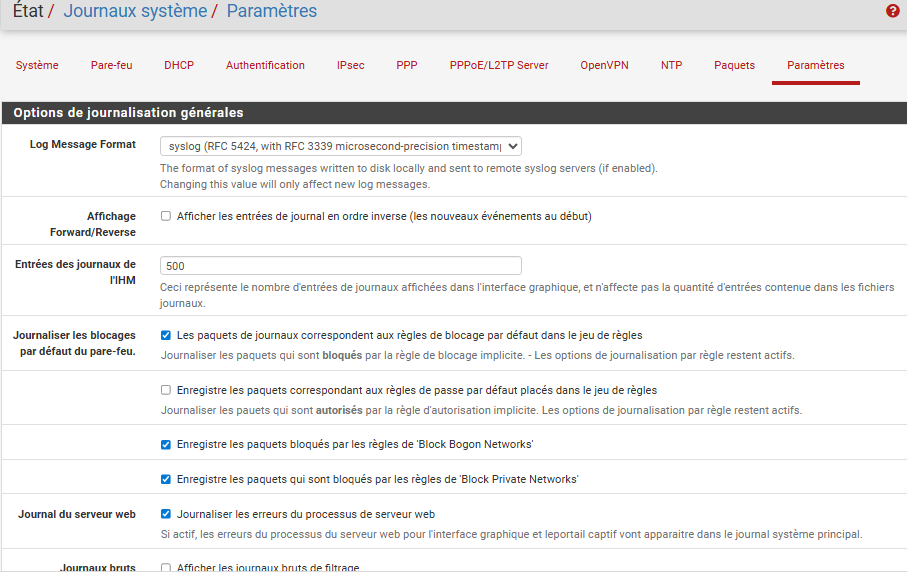
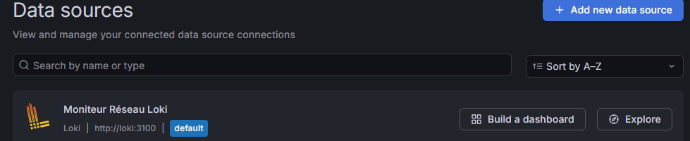
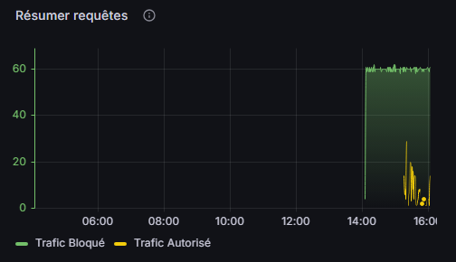
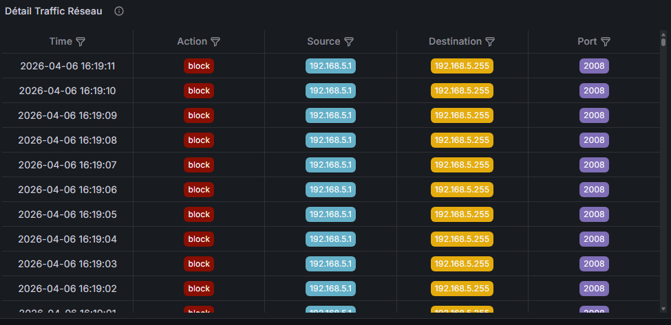
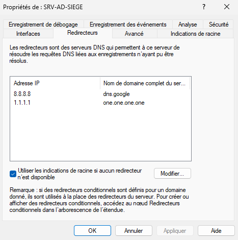

# Plan de sauvegarde et supervision

> Ce document décrit la stack de supervision (monitoring + logs) déployée dans la DMZ, ainsi que les éléments de sauvegarde de l'infrastructure.

---

## 1. Architecture de supervision

La supervision repose sur deux piliers complémentaires, tous deux hébergés en conteneurs Docker sur la machine Debian 12 (DMZ, `10.0.50.10`) :

- **Supervision réseau (logs)** : `Promtail` (collecte) → `Loki` (stockage/indexation) → `Grafana` (visualisation).
- **Supervision des ressources (métriques)** : `Node Exporter` / `Windows Exporter` (collecte) → `Prometheus` (stockage) → `Grafana` (visualisation).

```
pfSense (syslog) ──UDP 1514──▶ Promtail ──▶ Loki ──┐
                                                     ├──▶ Grafana (dashboards)
Windows Server (Windows Exporter :9182) ──┐         │
Debian DMZ (Node Exporter :9100) ─────────┼─▶ Prometheus ──┘
pfSense (Node Exporter :9100) ────────────┘
```

---

## 2. Supervision réseau (logs pare-feu)

### 2.1 Stack Loki / Promtail / Grafana

`docker-compose.yml` (extrait initial) :

```yaml
services:
  loki:
    image: grafana/loki:latest
    container_name: loki
    volumes:
      - ./config/loki-config.yml:/etc/loki/local-config.yaml
    command: -config.file=/etc/loki/local-config.yaml
    ports:
      - "3100:3100"
    restart: unless-stopped

  promtail:
    image: grafana/promtail:latest
    container_name: promtail
    volumes:
      - ./config/promtail.yml:/etc/promtail/config.yml
    command: -config.file=/etc/promtail/config.yml
    ports:
      - "1514:1514/udp"
      - "1514:1514/tcp"
    restart: unless-stopped

  grafana:
    image: grafana/grafana:latest
    container_name: grafana
    ports:
      - "3000:3000"
    environment:
      - GF_SECURITY_ADMIN_PASSWORD=AdminYmmo2026!
    restart: unless-stopped
```

> ⚠️ **Sécurité** : le mot de passe admin Grafana défini en variable d'environnement en clair (`AdminYmmo2026!`) doit être considéré comme un mot de passe de **démonstration uniquement**. En production, utiliser un secret externalisé (fichier `.env` exclu du dépôt Git, ou gestionnaire de secrets) et le changer après la première connexion.

### 2.2 Configuration Loki

```yaml
auth_enabled: false

server:
  http_listen_port: 3100

common:
  instance_addr: 127.0.0.1
  path_prefix: /tmp/loki
  storage:
    filesystem:
      chunks_directory: /tmp/loki/chunks
      rules_directory: /tmp/loki/rules
  replication_factor: 1
  ring:
    kvstore:
      store: inmemory

schema_config:
  configs:
    - from: 2020-10-24
      store: boltdb-shipper
      object_store: filesystem
      schema: v11
      index:
        prefix: index_
        period: 24h
```

> ⚠️ **Persistance** : le chemin `/tmp/loki` est volatile (effacé au redémarrage du conteneur/hôte). En production, ce chemin doit être remplacé par un volume Docker persistant (ex. `/opt/monitoring/data/loki`) monté en bind mount.

### 2.3 Configuration Promtail

```yaml
server:
  http_listen_port: 9080
  grpc_listen_port: 0

clients:
  - url: http://loki:3100/loki/api/v1/push

scrape_configs:
  - job_name: syslog
    syslog:
      listen_address: 0.0.0.0:1514
      listen_protocol: udp
      idle_timeout: 60s
      label_structured_data: yes
      labels:
        job: "pfsense-logs"
    relabel_configs:
      - source_labels: ['__syslog_message_hostname']
        target_label: 'host'
```

### 2.4 Configuration pfSense → Promtail

- Sur le pfSense siège : `Status > System Logs > Settings` — activer la **journalisation distante** vers `10.0.50.10:1514`, au format **RFC 5424** (format Promtail attendu).

  

- Sur les règles pare-feu autorisant le passage inter-VLAN, activer l'option **« Journaliser les paquets générés par cette règle »**, même pour les flux autorisés — nécessaire pour que les dashboards reflètent l'ensemble du trafic (accepté + bloqué).

### 2.5 Source de données Grafana

Ajout de la source de données **Loki** dans Grafana (`http://loki:3100`) :



Validation via l'onglet **Explore**, en filtrant par `job="pfsense-logs"`.

### 2.6 Dashboards réseau

**Dashboard "Graphique"** : visualisation en time series du volume de requêtes acceptées vs bloquées par minute.



Requêtes LogQL :

```logql
sum(count_over_time({job="pfsense-logs"} |= "block" [1m]))
sum(count_over_time({job="pfsense-logs"} |= "pass" [1m]))
```

**Dashboard "Détail"** : table détaillée par requête (action, IP source, IP destination, port).



Requête LogQL avec extraction de champs :

```logql
{job="pfsense-logs"}
| pattern "<_>,<_>,<_>,<_>,<interface>,<_>,<action>,<_>,<_>,<_>,<_>,<_>,<_>,<_>,<_>,<_>,<_>,<_>,<src_ip>,<dst_ip>,<src_port>,<dst_port>,<_>"
| line_format `{"Action":"{{.action}}", "Source":"{{.src_ip}}", "Destination":"{{.dst_ip}}", "Port":"{{.dst_port}}"}`
```

Transformations Grafana appliquées :
1. **Extract fields** : depuis le champ `Line`, format JSON.
2. **Organize fields** : conservation des champs `Action`, `Source`, `Destination`, `Port`.

---

## 3. Supervision des ressources (métriques)

### 3.1 Configuration Prometheus

`/opt/monitoring/config/prometheus.yml` :

```yaml
global:
  scrape_interval: 15s

scrape_configs:
  - job_name: 'prometheus'
    static_configs:
      - targets: ['localhost:9090']

  - job_name: 'debian-dmz'
    static_configs:
      - targets: ['node-exporter:9100']

  - job_name: 'windows'
    static_configs:
      - targets: ['10.0.10.10:9182']

  - job_name: 'pfsense-agence'
    static_configs:
      - targets: ['10.0.10.254:9100']
```

> ⚠️ **Cohérence d'adressage** : la cible `pfsense-agence` pointe ici vers `10.0.10.254`, qui est la **passerelle du VLAN 10 (Serveurs Siège)**, et non vers le pfSense agence (dont l'interface LAN est `10.1.30.254`, cf. [Architecture & Adressage](Architecture_Adressage.md)). Il s'agit très probablement du **pfSense siège** (Node Exporter installé sur le routeur du siège) plutôt que de l'agence — **le nom du job (`pfsense-agence`) est probablement à renommer en `pfsense-siege`** pour refléter la cible réelle. À vérifier et corriger dans la configuration réelle avant la soutenance.

### 3.2 Extension du docker-compose

```yaml
  prometheus:
    image: prom/prometheus:latest
    container_name: prometheus
    volumes:
      - ./config/prometheus.yml:/etc/prometheus/prometheus.yml
    command:
      - '--config.file=/etc/prometheus/prometheus.yml'
    ports:
      - "9090:9090"
    restart: unless-stopped

  node-exporter:
    image: prom/node-exporter:latest
    container_name: node-exporter
    volumes:
      - /proc:/host/proc:ro
      - /sys:/host/sys:ro
      - /:/rootfs:ro
    command:
      - '--path.procfs=/host/proc'
      - '--path.sysfs=/host/sys'
      - '--collector.filesystem.ignored-mount-points=^/(sys|proc|dev|host|etc)($$|/)'
    ports:
      - "9100:9100"
    restart: unless-stopped
```

```bash
docker-compose up -d
docker ps
```

### 3.3 Source de données et dashboards Grafana

- Ajout de la source de données **Prometheus** (`http://prometheus:9090`).
- Import du dashboard communautaire **Node Exporter Full** (ID Grafana : `1860`) pour la DMZ (Debian).
- Import du dashboard communautaire **Windows Exporter** (ID Grafana : `23942`) pour le Windows Server.
- Création d'un dashboard dédié pour le pfSense, à partir du fichier fourni dans `src/` :

  [`src/pfsense-agence-dashboard.json`](../src/pfsense-agence-dashboard.json)

  

### 3.4 Windows Exporter — Installation

Sur le Windows Server 2022, en PowerShell admin :

```powershell
[Net.ServicePointManager]::SecurityProtocol = [Net.SecurityProtocolType]::Tls12

$ApiUrl = "https://api.github.com/repos/prometheus-community/windows_exporter/releases/latest"
$DownloadUrl = (Invoke-RestMethod -Uri $ApiUrl).assets | Where-Object { $_.name -match "amd64\.msi$" } | Select-Object -ExpandProperty browser_download_url

Invoke-WebRequest -Uri $DownloadUrl -OutFile "C:\windows_exporter.msi"

Start-Process -Wait -FilePath "msiexec.exe" -ArgumentList "/i C:\windows_exporter.msi /qn"

New-NetFirewallRule -DisplayName "Prometheus Windows Exporter" -Direction Inbound -Action Allow -Protocol TCP -LocalPort 9182
```

Vérification : `http://localhost:9182/metrics`

Une règle pare-feu pfSense dédiée autorise le passage du trafic de métriques (port `9182`) depuis la DMZ vers le Windows Server.


### 3.5 Node Exporter sur pfSense

Installation du paquet **Node Exporter** via le gestionnaire de paquets pfSense, puis activation du service (port `9100`).

---

## 4. DNS — point de configuration lié à la supervision

Le Windows Server utilise des redirecteurs DNS publics (`1.1.1.1`, `8.8.8.8`) plutôt que pfSense, pour fiabiliser la résolution de noms (notamment lors de l'installation des composants de supervision).



> Ce choix de redirecteurs publics directs sur le serveur DNS est documenté comme un **correctif pragmatique** ; en production, il conviendrait d'évaluer un redirecteur interne (ex. pfSense) avec fallback public, pour conserver une visibilité centralisée des requêtes DNS.

---

## 5. Plan de sauvegarde

> ⚠️ **À compléter** : cette section décrit le plan de sauvegarde recommandé pour l'infrastructure. La mise en œuvre effective (planification, test de restauration) reste à documenter avec des captures d'écran issues de l'environnement.

### 5.1 Données à sauvegarder

| Composant | Donnée critique | Fréquence recommandée | Méthode |
|:---|:---|:---|:---|
| Active Directory (Windows Server) | Base AD (NTDS), GPO | Quotidienne | Sauvegarde Windows Server (Windows Server Backup) — état système |
| Partage de fichiers `DATA$` | Données métiers des 5 pôles | Quotidienne | Copie incrémentale vers stockage dédié / cloud |
| Base de données MySQL (DMZ) | Données applicatives (site web) | Quotidienne | `mysqldump` planifié + export vers stockage externe |
| MinIO (DMZ) | Images / fichiers du site web | Hebdomadaire (ou synchro continue) | Réplication / snapshot du volume Docker |
| Configurations Docker (DMZ) | `docker-compose.yml`, fichiers `config/` | À chaque modification | Versionnage Git (dépôt privé) |
| Configuration pfSense (siège + agence) | Fichier `config.xml` | À chaque modification significative | Export manuel via interface web, archivage |
| Dashboards Grafana / configuration Prometheus | Dashboards JSON, `prometheus.yml` | À chaque modification | Versionnage Git (dossier `src/`) |

### 5.2 Rétention recommandée

- Sauvegardes quotidiennes : conservation **7 jours**.
- Sauvegardes hebdomadaires : conservation **4 semaines**.
- Sauvegardes mensuelles : conservation **6 à 12 mois** (selon obligations légales/comptables du pôle concerné).

### 5.3 Stockage des sauvegardes

- **Règle 3-2-1 recommandée** : 3 copies des données, sur 2 supports différents, dont 1 hors site.
- Dans le contexte de cette infrastructure : une copie locale (disque dédié sur le Windows Server ou la DMZ), une copie sur un stockage cloud externe (cf. [Solution Cloud](Solution_Cloud.md)).

### 5.4 Tests de restauration

- Un test de restauration (partiel ou complet) doit être planifié au minimum **trimestriellement**, afin de valider l'intégrité des sauvegardes et le temps de restauration réel (RTO).

---

## Voir aussi

- [Architecture & Adressage](Architecture_Adressage.md)
- [Guide de configuration des serveurs](Guide_Configuration_Serveurs.md)
- [Solution Cloud](Solution_Cloud.md)

---

## Images attendues pour ce document

- *(Manquant, recommandé)* une capture du **dashboard Node Exporter Full** (ID 1860) une fois importé pour la DMZ.
- *(Manquant, recommandé)* une capture du **dashboard Windows Exporter** (ID 23942).
- *(Manquant, recommandé)* une capture/diagramme illustrant le **plan de sauvegarde** (schéma 3-2-1), à créer pour la section 5.
