# Sécurité & Droits d'accès

> Ce document décrit la gestion des droits d'accès aux ressources selon les règles de Windows Server 2022 / Active Directory, ainsi que les règles de pare-feu pfSense permettant de contrôler les flux entre les différents VLANs et le VPN.

---

## Principe général : Deny by default

L'ensemble de l'infrastructure repose sur le principe **« Deny by default »** : tout flux ou accès non explicitement autorisé est refusé.

- Sur les pare-feu pfSense, aucune règle « allow all » n'est conservée en production : chaque VLAN ne communique qu'avec les ressources qui lui sont strictement nécessaires.
- Sur le partage de fichiers Windows (`DATA$`), l'héritage des permissions est désactivé sur chaque dossier de pôle, et seuls les groupes de sécurité concernés obtiennent un accès explicite.
- Tout utilisateur ou poste non identifié dans Active Directory n'a accès à aucune ressource interne.

---

## Schéma des règles d'accès par pôle de l'entreprise

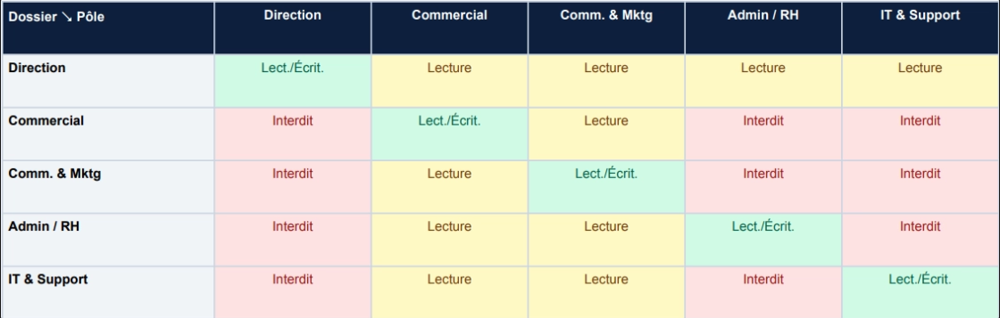

---

## Organisation Active Directory

L'arborescence Active Directory du domaine `alc.local` repose sur une unité d'organisation principale **ALC_Entreprise**, elle-même divisée en deux unités d'organisation (OU) représentant les sites :

- **Employes_Siege** (Aix-en-Provence)
- **Employes_Agence_Toulouse**

Chacune de ces OU contient les **5 pôles** de l'entreprise, permettant de structurer les utilisateurs selon leur poste, indépendamment de leur site de rattachement.

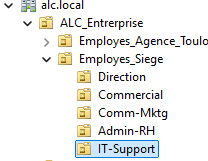

### Groupes de sécurité

5 groupes de sécurité sont créés dans Active Directory, un par pôle. Ils servent de support à l'attribution des droits NTFS sur le partage de fichiers et à l'application des GPO ciblées.

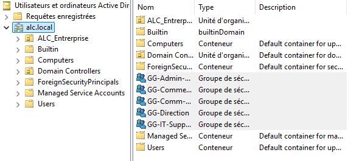

Chaque utilisateur est ajouté au groupe de sécurité correspondant à son pôle via l'onglet **Membre de** de ses propriétés AD :

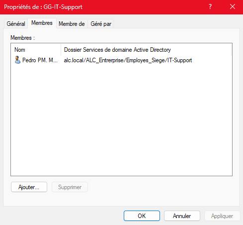

> **Pôles couverts** : la structure est commune au siège et à l'agence — un même découpage en 5 pôles est répliqué dans chaque OU de site, garantissant une politique de droits homogène sur l'ensemble de l'infrastructure.

---

## Plan de droits d'accès par pôle

### Partage de fichiers `DATA$`

Le partage de fichiers est hébergé sur le Windows Server 2022 (VLAN 10), sur un disque virtuel dédié, dans un dossier `DATA` partagé sous le nom **`DATA$`**.

- Le suffixe `$` rend le partage invisible dans l'exploration réseau : les utilisateurs n'accèdent pas à une « racine » visible, mais directement à leurs dossiers de pôle via un lecteur réseau mappé.
- Au niveau du partage (onglet **Partage avancé**), le contrôle total est accordé à « Tout le monde » : les **restrictions réelles sont appliquées au niveau NTFS, sur chaque sous-dossier de pôle**.

### Dossiers de pôles

Dans `Partages_Entreprise`, 5 dossiers sont créés (un par pôle) :

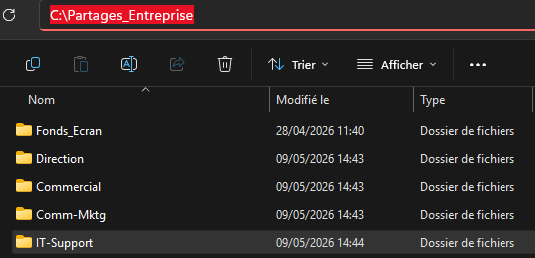

Pour chaque dossier :

1. **Désactivation de l'héritage** des permissions NTFS (onglet Sécurité > Avancé), en convertissant les permissions héritées en permissions explicites.
2. **Suppression de l'accès pour les utilisateurs lambda** : par défaut, seul le groupe Administrateurs conserve l'accès.
3. **Ajout des droits du groupe de sécurité correspondant au pôle**, avec le niveau d'accès défini selon le tableau ci-dessous.

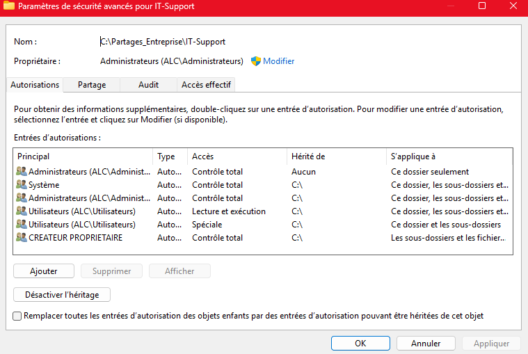

### Matrice des droits (modèle)

| Pôle | Groupe de sécurité AD | Dossier `DATA$\<Pôle>` | Niveau d'accès |
|:---|:---|:---|:---|
| Pôle 1 | `GS-Pole1` | `DATA$\Pole1` | Lecture/Écriture (membres du pôle uniquement) |
| Pôle 2 | `GS-Pole2` | `DATA$\Pole2` | Lecture/Écriture (membres du pôle uniquement) |
| Pôle 3 | `GS-Pole3` | `DATA$\Pole3` | Lecture/Écriture (membres du pôle uniquement) |
| Pôle 4 | `GS-Pole4` | `DATA$\Pole4` | Lecture/Écriture (membres du pôle uniquement) |
| Pôle 5 (IT-Support) | `GS-Pole5-IT` | `DATA$\IT-Support` | Lecture/Écriture (équipe IT) + accès admin transverse |
| Administrateurs | `Domain Admins` | `DATA$\*` | Contrôle total sur l'ensemble de l'arborescence |

> **À compléter par l'auteur :** remplacer `Pole1`...`Pole5` par les noms réels des pôles de l'entreprise (ex. Direction, RH, Comptabilité, Commercial, IT-Support), pour cohérence avec les noms des groupes de sécurité et des dossiers réellement créés dans AD.

### Accès au partage côté client

Le lecteur réseau est mappé automatiquement par GPO (voir [Guide de déploiement](Guide_Deploiement.md), section *Règle GPO d'harmonisation*), sur le chemin `\\10.0.10.10\DATA$`, sous la lettre `S:` ou `P:`.

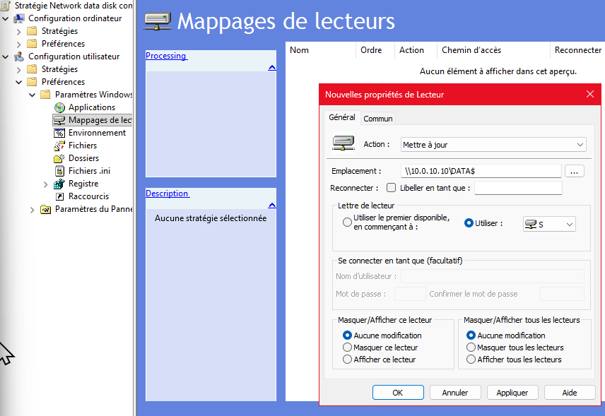

---

## Règles de pare-feu pfSense

### Principes appliqués

- **Deny by default** sur toutes les interfaces : aucun flux n'est autorisé sans règle explicite.
- **Segmentation stricte par VLAN** : un poste du VLAN 20 (LAN Siège) ne peut pas, par défaut, dialoguer avec le VLAN 50 (DMZ) ou le VLAN 30 (agence), sauf règle dédiée.
- **Désactivation du blocage RFC1918** sur l'interface WAN des deux pfSense (siège et agence), car l'environnement de maquette est entièrement virtualisé derrière une box dont l'adresse WAN est elle-même privée. *(Cette désactivation est spécifique à l'environnement de maquette ; en production avec une vraie adresse publique, cette règle de blocage RFC1918 devrait être réactivée.)*
- **Journalisation des paquets** activée sur les règles de passage VLAN ↔ LAN/DMZ, même pour le trafic autorisé, afin d'alimenter la supervision via Loki/Grafana (voir [Plan de sauvegarde et supervision](Sauvegarde_Supervision.md)).

### Matrice de flux (synthèse)

| Source | Destination | Port / Service | Autorisé ? | Justification |
|:---|:---|:---|:---|:---|
| VLAN 20 (LAN Siège) | VLAN 10 (Serveurs) | DNS, DHCP, AD/LDAP, SMB (445) | ✅ | Authentification, résolution de noms, partage de fichiers |
| VLAN 20 (LAN Siège) | VLAN 50 (DMZ) | HTTP/HTTPS (80/443) | ✅ | Accès au site web interne / outils |
| VLAN 20 (LAN Siège) | Internet (WAN) | HTTP/HTTPS | ✅ | Navigation web |
| VLAN 30 (LAN Agence) | VLAN 10 (Serveurs, via VPN) | DNS, DHCP, AD/LDAP, SMB (445) | ✅ | Authentification centralisée, partage de fichiers |
| VLAN 30 (LAN Agence) | VLAN 50 (DMZ, via VPN) | HTTP/HTTPS (80/443) | ✅ | Accès aux services applicatifs du siège |
| VLAN 50 (DMZ) | Internet (WAN) | HTTPS (443), apt/pip (mises à jour) | ✅ | Mises à jour système, accès dépôts Docker |
| Internet (WAN) | VLAN 50 (DMZ) | HTTPS (443) — port forwarding | ✅ (règle NAT dédiée) | Exposition de l'application web aux utilisateurs externes |
| Internet (WAN) | VLAN 10 / 20 / 30 | * | ❌ | Aucune exposition directe des postes/serveurs internes |
| Interco VPN (172.16.0.0/30) | Tous VLANs concernés | Selon besoin | ✅ (règles dédiées) | Interconnexion siège ↔ agence |
| WAN → pfSense (interface admin) | — | HTTP/HTTPS interface pfSense | ❌ | Interface d'administration accessible uniquement depuis le LAN |
| Machine personnelle (admin) | VLAN 50 (DMZ) | SSH (22) | ✅ (règle NAT dédiée) | Administration à distance de la DMZ |
| Toutes interfaces | Tous VLANs | OpenVPN (UDP 1194) | ✅ (sur WAN uniquement) | Établissement du tunnel VPN siège ↔ agence |

### Règles spécifiques notables

- **Accès SSH à la DMZ depuis l'extérieur** : une règle NAT sur le pfSense siège redirige un port WAN vers le port 22 de la machine Debian (`10.0.50.10`), permettant l'administration distante.

  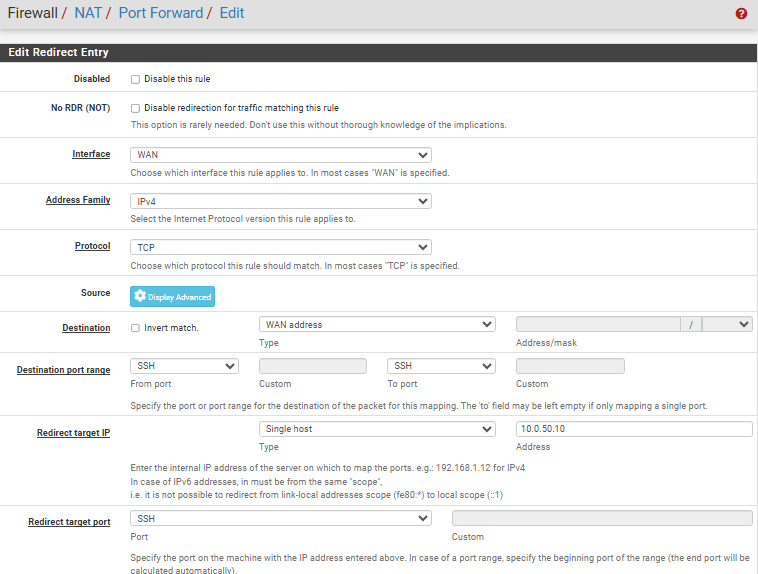

- **Exposition de l'application web** : une règle NAT/port forwarding sur le pfSense siège expose le service web hébergé en DMZ (`10.0.50.10`) vers Internet.

  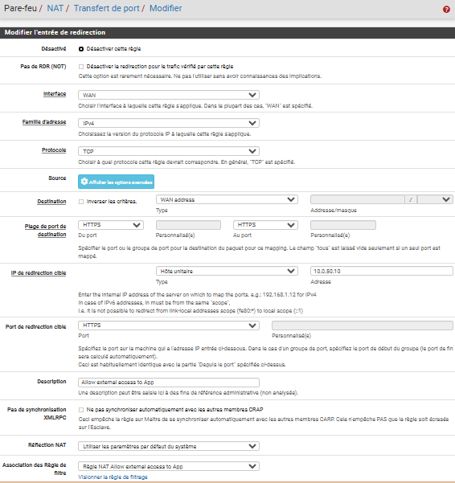

- **VPN siège ↔ agence** : règles dédiées sur chaque pfSense pour autoriser le port `1194/UDP` sur le WAN, et règles supplémentaires pour autoriser le trafic provenant du tunnel vers les VLANs cibles.

  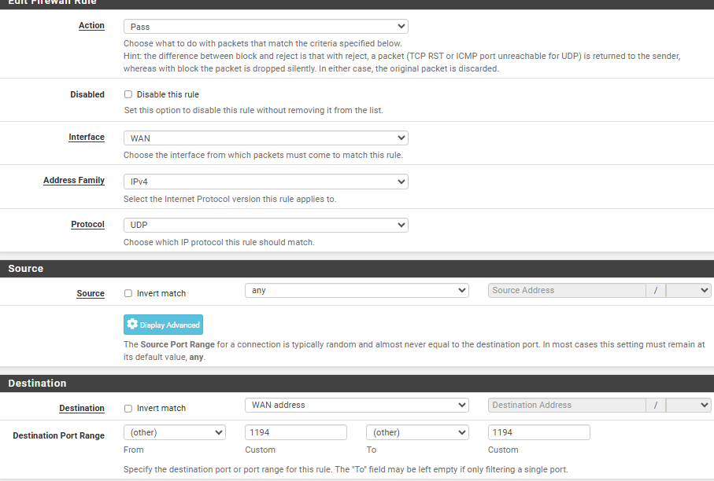
  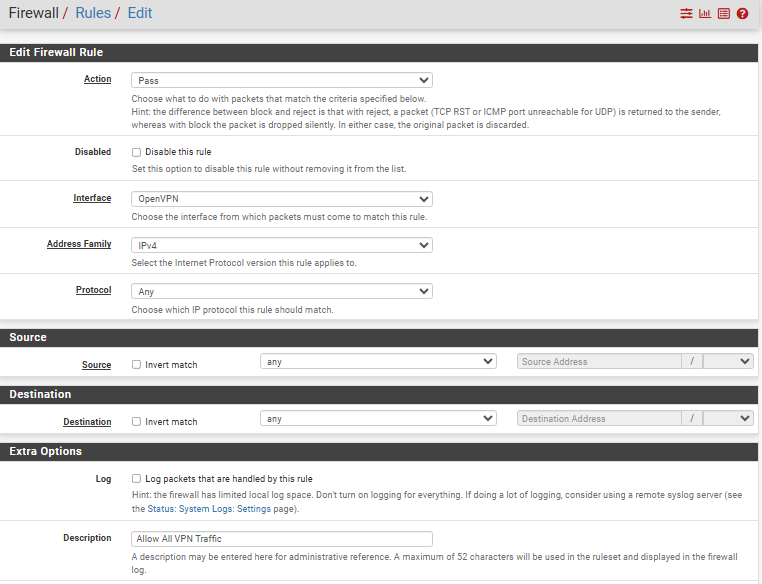

- **Supervision réseau** : les métriques du pfSense siège sont exposées via Node Exporter (port `9100`) à destination de Prometheus (DMZ), avec une règle pare-feu dédiée.

  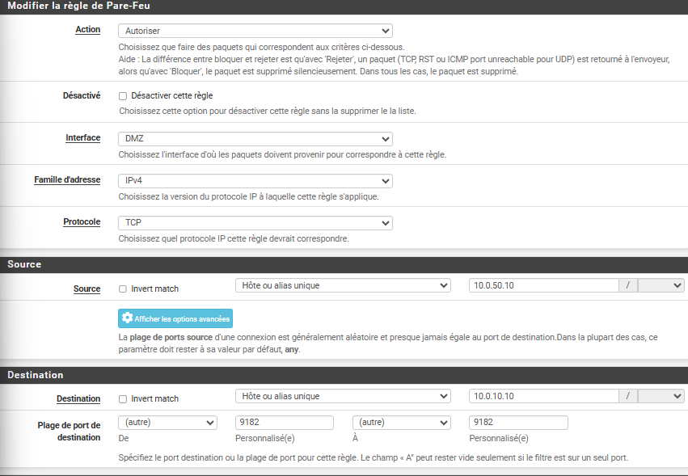

---

## Politique de mots de passe et de verrouillage

> Cette section complète la [Politique de sécurité](Politique_Securite.md) du point de vue strictement Active Directory / accès.

- **Verrouillage de session automatique** : configuré par GPO, déclenché après **5 minutes d'inactivité** (300 secondes), sur tous les postes du domaine (siège et agence).
- **Restriction des outils d'administration sur les postes clients** : accès au Panneau de configuration et à l'invite de commandes (`cmd.exe` / PowerShell) désactivé par GPO pour les utilisateurs standards, afin de limiter les risques de contournement des politiques de sécurité.